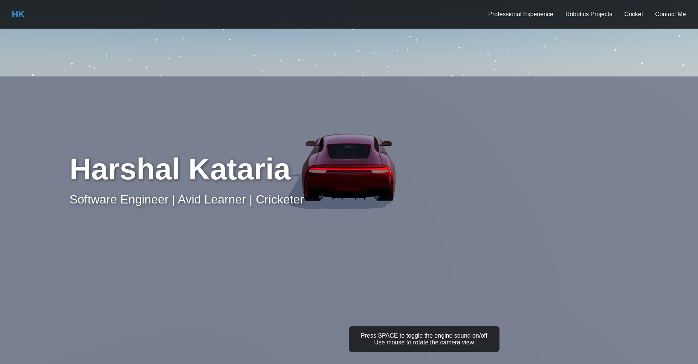

# Harshal Kataria - Personal Portfolio Website

A modern, interactive portfolio website built with React, Vite, and Three.js. This project features an engaging 3D experience, smooth animations, and responsive design to showcase my professional background and personal interests.



## ✨ Features

- **Interactive 3D Experience**: Engaging Three.js-powered 3D scene with custom vehicle model
- **Responsive Design**: Looks great on all devices from mobile to desktop
- **Performance Optimized**: Fast loading times and smooth interactions
- **Modern Tech Stack**: Built with React, Vite, and styled-components

## 🚀 Getting Started

### Prerequisites

- Node.js (v18 or newer recommended)
- npm or yarn

### Installation

1. Clone this repository:

   ```bash
   git clone https://github.com/harshalkataria/portfolio-website.git
   cd portfolio-website
   ```

2. Install dependencies:

   ```bash
   npm install
   ```

3. Start the development server:

   ```bash
   npm run dev
   ```

4. Open your browser and navigate to `http://localhost:5173`

## 🎨 Configuration

All configuration files are located in the `src/config` directory:

- `profile.js` - Personal information and section settings
- `theme.js` - Color schemes, fonts, and styling variables
- `models.js` - 3D model settings and properties
- `sounds.js` - Sound effect configurations

## 📁 Project Structure

```
src/
├── assets/           # Static assets like images and fonts
├── components/       # Reusable components
│   ├── 3d/           # Three.js 3D components
│   │   ├── environment/  # Scene environment components
│   │   └── vehicle/      # Vehicle model components
│   ├── debug/        # Debugging components
│   ├── layout/       # Layout components
│   └── ui/           # User interface components
├── config/           # Configuration files
├── hooks/            # Custom React hooks
├── pages/            # Page components
└── styles/           # Global styles
public/
├── models/           # 3D model files (GLB/GLTF)
└── sounds/           # Sound files (MP3/WAV)
docs/
└── journey/          # Documentation of development journey
```

## 🛠️ Technologies Used

- [React](https://reactjs.org/) - UI library
- [Vite](https://vitejs.dev/) - Build tool and development server
- [Three.js](https://threejs.org/) - 3D graphics library
- [React Three Fiber](https://github.com/pmndrs/react-three-fiber) - React renderer for Three.js
- [React Three Drei](https://github.com/pmndrs/drei) - Helpers for React Three Fiber
- [React Three Cannon](https://github.com/pmndrs/use-cannon) - Physics for React Three Fiber
- [Framer Motion](https://www.framer.com/motion/) - Animation library
- [Styled Components](https://styled-components.com/) - CSS-in-JS styling

## 🔧 Development Journey

I've documented my development process in a series of journal entries:

- [Day 1: Project Setup](./docs/journey/Day1-Setup.md)
- [Day 2: Importing Car Model](./docs/journey/Day2-ImportingCarModel.md)

## 🤝 Contributing

Interested in contributing? Check out the [Contributing Guide](./docs/CONTRIBUTING.md).

## 📄 License

This project is [MIT](./LICENSE) licensed.

## 🙏 Acknowledgments

- Inspired by modern portfolio designs and interactive web experiences
- Special thanks to the React and Three.js communities for their incredible tools and documentation
